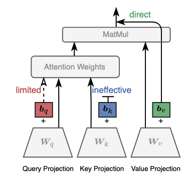

# BEFT 
BEFT: Bias-Terms-Efficient Fine-Tuning of Language Models




# Environment 

```bash
pip install -r requirements.txt
```

# Bias-Selection Approaches:
> We provide a notebook `tutorial.ipynb` for a simple tutorial with visualizing importance ranking by different bias-selection approaches.

To get the importance ranking by **our bias-efficient approch** and **_Magnitude_ approach** for BERT<sub>BASE</sub> on low-date RTE dataset:

```bash
python run_BEFT.py 
       --task-name rte\  
       --model-name bert-base-cased
```

To get the importance ranking by **_Fisher_ approach** for BERT<sub>BASE</sub> on low-date RTE dataset:

```bash
python run_BEFT.py 
       --task-name rte\  
       --model-name bert-base-cased\
       --fisher True\
       --batch-size 8
```

To get the performance of fine-tuning among **b**<sub>v</sub>, **b**<sub>q</sub>, and **b**<sub>k</sub> for BERT<sub>BASE</sub> on low-date RTE dataset:

```
python run_BEFT.py 
       --task-name rte\  
       --model-name bert-base-cased\
       --bias-terms-loop True
```

# Generalize to Autoregressive LLMs:
To generalize our findings to get the performance of **b**<sub>v</sub>, **b**<sub>q</sub>, and **b**<sub>k</sub> for OPT-1.3B on low-date RTE dataset:
```
bash autoregressive_llm/finetune_BEFT.sh
```

To get the performance of prefix-tuning and LoRA fine-tuning for OPT-1.3B on low-date RTE dataset:
```bash
# prefix-tuning
MODE=prefix bash autoregressive_llm/finetune.sh

# LoRA
MODE=lora bash autoregressive_llm/finetune.sh
```

To get the performance the ICL and Zero-Shot techniques for OPT-1.3B on low-date RTE dataset:
```bash
# In-context learning
bash autoregressive_llm/icl.sh 

# Zero-shot
bash autoregressive_llm/icl.sh --num_train 0
```

